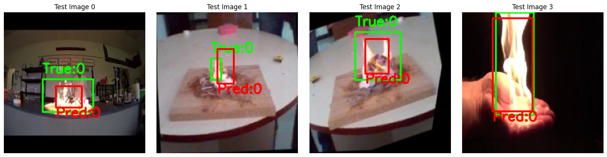

## Introduction
This project is a reimplementation of the **YOLOv1 (You Only Look Once)** object detection architecture, using MobileNetV2 as the lightweight backbone for feature extraction. The model predicts bouding boxes and class probabilities (fire, smoke), implemented in Pytorch for educational purposes.

To improve accuracy, i also use **YOLOv8**, a high-performence model from **Ultralytics**. YOLOv8 provide better precision and speed, making it suitable for real-world applications.

# Project Architecture of YOLOv1
**Backbone**: MobileNetV2
- pretrained
- input are 224 x 224 x 3 images
- output are 1280 x 7 x 7 feature maps

**Head**:
- Convolutional layers to further process the features.
- Fully connected layers to output final grid predictions.

**Output**: A tensor of shape (Batch, 7, 7, 12), Each cell predicts:
- 2 bounding boxes (with center (x, y) in cell, width, height, confidence)
- 2 class scores (you can modify this depending on your dataset)

## Loss & Evaluation
An **Intersection over Union (IoU)** function is implemented to calculate the overlap between predicted and ground truth bounding boxes. This is a key component in evaluating the performance of object detection models.

## Prediction

# YOLOv8
The project uses pretrained weights `yolov8s.pt` on the COCO dataset, then fine-tuned on our custom fire-smoke dataset. It achieves a confidence score of approximately **0.91**

